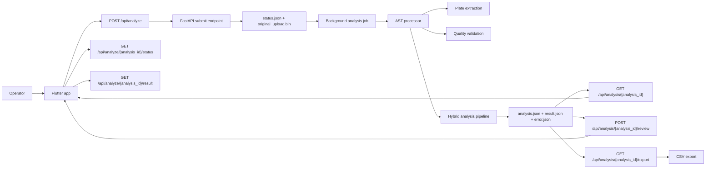

# Architecture

## System Overview
The application is split into a Flutter frontend and a FastAPI backend. The frontend owns the operator workflow. The backend owns image processing, OCR, measurement, persistence, and CSV generation.

## Repository Layout
- `Backend/app/main.py`: FastAPI application entry point, CORS, router registration
- `Backend/app/api/analyze.py`: public API endpoints
- `Backend/app/core/config.py`: environment-backed settings
- `Backend/app/models/schemas.py`: request and response models
- `Backend/app/services/ast_processor.py`: upload validation and orchestration entry point
- `Backend/app/services/analysis_store.py`: filesystem persistence and CSV export
- `Backend/app/services/quality_validator.py`: image quality warnings
- `Backend/app/services/expert_engine.py`: final status and review summary
- `Backend/app/services/panel_resolver.py`: soft layout assist for disc labels
- `Backend/app/ml/inference.py`: hybrid analysis orchestration
- `Backend/app/ml/ocr_classifier.py`: local OCR, whitelist matching, rotation voting, confidence tiers
- `Backend/app/utils/*.py`: plate extraction, disc detection, calibration, disc ROI, measurement, zone detection
- `Backend/tests/`: unit, integration, and real-fixture regression coverage
- `frontend/lib/main.dart`: Flutter application entry point
- `frontend/lib/routes/app_routes.dart`: route map
- `frontend/lib/features/image_upload/`: capture and upload flow
- `frontend/lib/features/analysis/`: review screen and view model
- `frontend/lib/features/result/`: final table view and interpretation
- `frontend/lib/data/api/ast_api_service.dart`: backend HTTP client
- `frontend/lib/data/models/ast_result_model.dart`: session and summary models
- `frontend/lib/core/models/analysis_result.dart`: per-disc review model
- `frontend/lib/data/local/antibiotic_rules.json`: local interpretation thresholds used by the result screen

## Frontend Architecture
The Flutter app is an operator workflow client built around simple view models and route-based navigation.

### Screen Flow
- `/`: splash
- `/home`: landing screen
- `/image_upload`: camera and gallery selection
- `/analysis`: upload result review screen
- `/result`: final result table

### Frontend Responsibilities
- Collect an image path from camera or gallery
- Upload the image to the backend
- Render the returned `analysis_id` session
- Show debug overlay and disc crop previews when returned
- Allow manual code confirmation and diameter correction
- Persist review changes through the review API
- Render the final table and local interpretation names

### Frontend Data Notes
- `AstApiService` now reads `BACKEND_BASE_URL` from `--dart-define`, defaulting to `http://127.0.0.1:8000`.
- `AnalysisViewModel` performs the full analyze -> review-save -> result-screen workflow.
- `ResultViewModel` performs local susceptible/intermediate/resistant interpretation only when a matching local rule exists.
- The frontend does not currently call `GET /api/analysis/{analysis_id}` or `GET /api/analysis/{analysis_id}/export`, even though both are live backend endpoints.

## Backend Architecture

### Entry And Routing
- `app.main` creates the FastAPI app.
- CORS is configured from `CORS_ALLOW_ORIGINS`.
- All API routes are mounted under `/api`.

### Runtime Flow
1. `POST /api/analyze` checks the uploaded content type, saves the upload, creates `status.json`, and returns an `analysis_id` immediately.
2. A background job picks up the saved upload and updates `status.json` as it progresses.
3. `run_ast_analysis` enforces non-empty upload and `MAX_UPLOAD_BYTES`.
4. `load_image_from_bytes` decodes the image.
5. `extract_plate` detects and crops the plate area.
6. `validate_image_quality` records blur, brightness, contrast, glare, and clipped-plate warnings.
7. `hybrid_analysis_pipeline` performs:
   - disc detection
   - disc-radius refinement
   - 6 mm calibration
   - disc crop extraction
   - OCR with whitelist matching
   - zone measurement
   - result confidence and status assembly
   - optional overlay generation
8. `save_analysis_record` writes `analysis.json`, `result.json`, and the final completed status.
9. The Flutter client polls `GET /api/analyze/{analysis_id}/status` until the job is complete, then fetches `GET /api/analyze/{analysis_id}/result`.
10. On backend startup, any leftover `queued` or `processing` job is marked as `failed` with an interrupted-job message so clients never poll forever after a service restart.

## Image Analysis Pipeline

### Plate Detection
- Primary method: scored Hough circle detection
- Fallback: contour-based circular crop
- Output: plate center, plate radius, clipped flags, and warnings

### Disc Detection
- Bright-disc search inside the plate mask
- Bright-core masking for white paper discs
- Circular contour filtering
- Hough fallback when component geometry is weak
- Radius refinement to support stable 6 mm calibration

### Calibration
- Uses the detected disc diameters in pixels
- Converts pixels to millimeters using the hard 6 mm disc rule
- Stores average disc diameter, mm-per-pixel, disc count, and spread

### OCR And Label Recognition
- Disc ROI extraction centers and masks the disc crop
- OCR preprocessing includes CLAHE, denoising, sharpening, blackhat text enhancement, Otsu and adaptive threshold variants
- OCR runs across multiple rotations and Tesseract page-segmentation modes
- Output is compared only against the internal whitelist in `ocr_classifier.py`
- Confidence tiers:
  - `high_confidence_exact`
  - `probable_match`
  - `uncertain_manual_confirmation_required`
  - `failed_unknown`
- Soft layout assistance from `panel_resolver.py` is allowed, but it is review-safe rather than silent override logic

### Zone Measurement
- Uses CLAHE, blur smoothing, adaptive thresholding, Canny edges, radial evidence, contour fitting, and low-contrast energy fallback
- Measures the outer inhibition boundary, not the disc itself
- Uses `6 mm` only when no trustworthy zone boundary evidence exists
- Keeps low-confidence estimated diameters instead of collapsing everything to `6 mm`

## analysis_id Lifecycle
The backend creates a UUID for every analysis. That UUID becomes the durable handle for:
- the original uploaded image
- the persisted automatic output
- later review edits
- later fetch requests
- CSV export

Each `analysis_id` gets its own directory under `Backend/data/analysis_runs/<analysis_id>`.

## Persistence Model
Each analysis directory stores:
- `original_upload.bin`: the raw uploaded image bytes
- `status.json`: async job state, progress, stage, and timings
- `result.json`: final `AnalysisResponse`
- `error.json`: failure details when a job crashes or validation fails
- `analysis.json`: the persisted analysis session, including auto values and any reviewed values
- optional debug images such as `plate_overlay.png`

Review updates do not destroy the automatic measurements. They add corrected values and update `final_code`, `final_diameter_mm`, `status`, `source`, and review metadata inside the same persisted analysis record.

## Async Job Guarantees
- `POST /api/analyze` performs upload validation, persists the image, and returns immediately with `202 Accepted`.
- Status polling is read-only. It never re-runs OCR or measurement.
- The backend only writes `result.json` and marks a job `completed` after the final payload has been fully serialized.
- If the backend process restarts mid-analysis, the next startup converts those orphaned jobs into `failed` status with a retry message instead of leaving them stuck in `queued` or `processing`.

## Active Runtime Dependencies vs Optional Modules
The current production path uses FastAPI, OpenCV, NumPy, and Tesseract OCR directly.

The backend dependency file also includes `torch`, `torchvision`, `ultralytics`, `openai`, and `google-genai`, but the current public analyze/review workflow is not wired to those packages. They should be treated as declared but not active requirements for the current API path.
